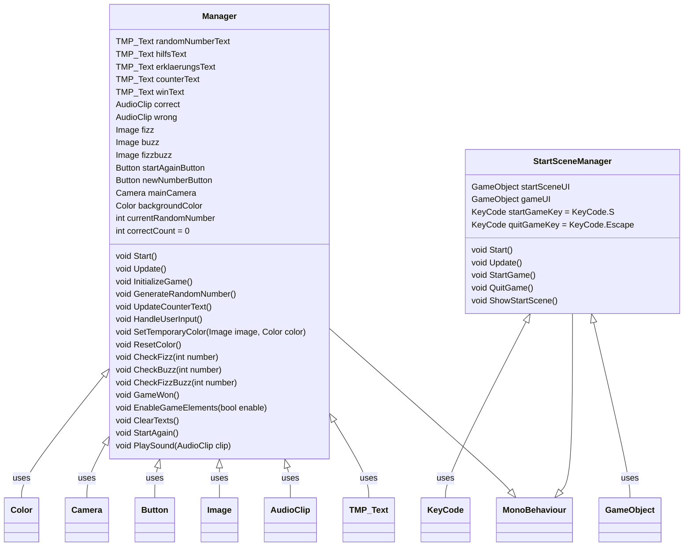

# 05-endabgabefizzbuzz-lcengu

### Spielanleitung: 
_In diesem Spiel geht es darum die Teilbarkeit von Zahlen zu beschreiben und die Teilbarkeitsregeln von 3 als auch 5 einzusetzen. Mit Hilfe von MakeyMakey werden Alltagsgegenstände zu interaktiven Spielobjekten. Das Ziel von FizzBuzz ist es, 10 richtige Antworten zu geben und spielend das Gehirn zu trainieren._

#### Starten Sie das Spiel mit dem Key S auf der Tastatur! 

Es existieren folgende Befehle: 

-	Fizz – Zahl ist durch 3 teilbar, das ist sie, wenn ihre Quersumme durch 3 teilbar ist; drücken Sie die linke Pfeiltaste oder MakeyMakey Apfel 

-	Buzz – Zahl ist durch 5 teilbar, das ist sie, wenn die letzte Ziffer 0 oder 5 ist; drücken Sie die rechte Pfeiltaste oder MakeyMakey Orange 

-	FizzBuzz – Zahl ist sowohl durch 3 als auch durch5 teilbar, das ist sie, wenn die letzte Ziffer 0 bzw. 5 ist oder ihre Quersumme durch 3 teilbar ist; drücken sie die Leertaste oder MakeyMakey das Wasser 

Sollte die Zahl weder durch 3 oder 5 teilbar ist, generieren sie eine neue Zahl in dem Sie die obere Pfeiltaste drücken bzw MakeyMakey die Banane. 
#### Viel Spass! 

---

### Auswertung Fragebögen: 
Das Alter der Testpersonen variiert, 17, 16 und 63 Jahre alt
Alle Testenden Personen sind Anfänger, die Benutzeroberfläche wird als intuitiv bewertet und auch die Anweisungen als mittel bis hilfreich. 
Das Spielerlebnis wurde als mittlere Unterhaltung und mittlere herausfordernd eingestuft, die Motivation das Spiel zu spielen war da. 
Während des Spieles gab es keine Fehler oder Abstürze. Das Feedback war klar verständlich, es wurde mit Ton, Farbe und Beschreibungen gearbeitet. Zusätzlich zu der Information, dass die Antwort falsch ist, gab es eine Begründung, warum. Den Testern haben vor allem die Feedbacks gefallen und die Erklärungen dazu. Man könnte mehrere Levels einbauen um das Spiel interessanter zu gestalten 

--- 

### MERMAID DIAGRAMME: 

